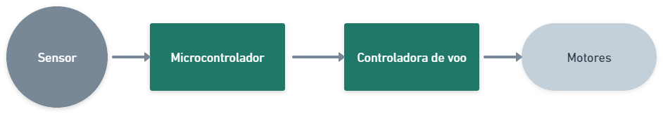
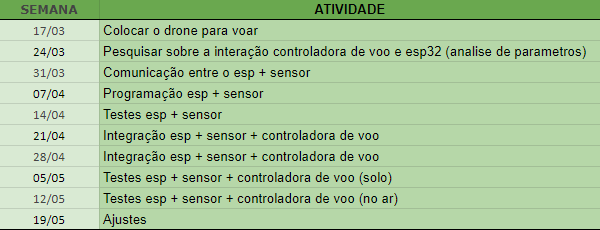

# PI3
Repositorio designado a disciplina de projeto Integrador 3, o projeto em questão é um Detect and Avoid para um drone de peueno porte.
 <b>Objetivo:</b> Um sistema que detecta e evita objetos, para uma aeronave remotamente tripulada.
 <b>Introdução:</b> em uma aeronave remotamente tripulada é comum o piloto ter uma visão limitada, onde fica exposto aos perigos do ambiente como: galhos de arvores, postes, prédios e entre outros. Para solucionar esse problema é comum encontra em um sistema de <i>Detect&Avoid</i>
 
 
 Definição dos componentes:
 
 → Esp32 - microcontrolador
   Frequência do clock: 160MHz
   Fácil acesso no Laboratório de Drones
 
 → Pixhawk - controladora de voo 
   Firmware: ArduPilot
   Fácil acesso no Laboratório de Drones
   Frequência de trabalho de 187MHz
 
 → gy-us42 - sensor ultrassônico 
   Alcance de 0,2 á 7,2m 
   Resolução de 1mm
   Frequência de resposta é de 15Hz, e sua folha de dados é possível encontrar o feixe de alcance desse sensor.
 
 Levando em conta que a velocidade maxima do drone é de 5m/s, e o tempo de resposta do sensor é de 600ms, para que o drone não sofra a colisão o objeto precisa ser visto a pelo menos  
 O cronograma a ser seguido, se encontra a seguir:
 

